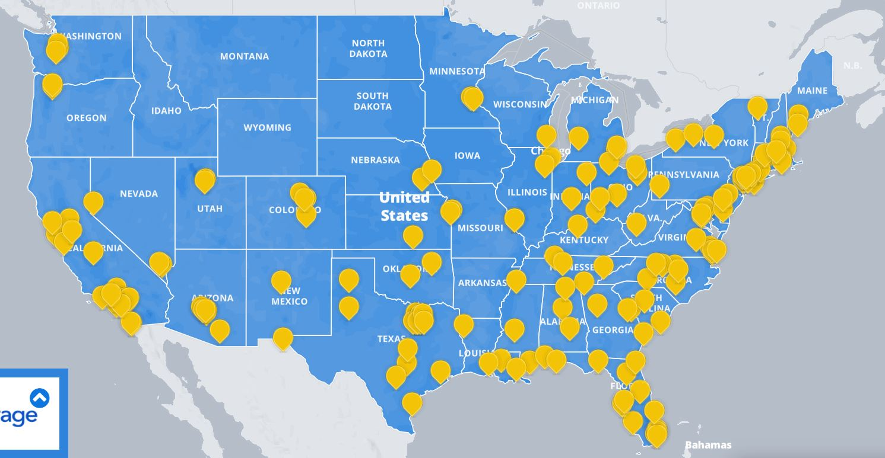

Assignment 4 - DataVis Remix + Multiple Views
===

# Original Vis & Critique
The original vis for this assignment was a map showing storage unit prices
at various locations in the U.S. for 2020. It was made by the storage company [LifeStorage](https://www.lifestorage.com/blog/storage/storage-unit-costs/). 

The original vis allows the user to lookup prices by city, browse by location,
and explore by clicking on various cities. It has a nice collapsible description window,
which explains where the data is from and how to use the map. It
allows the user to click on one city at a time to view its information. 
The data is tabular; the geographic states are shown but have no function other than
to help the user find their city.

The main problem is that the vis functions almost solely as a lookup tool.
 The user cannot compare prices between locations unless they remember what the previous
 popup said when they click on a different state. 

# New Vis 
In my remix, I add color to the map to show price comparisons between states. As one might 
expect, this allows the viewer to see a pattern of higher prices along the coasts.
I also add a bar graph on the right comparing prices for all states for the current
storage unit size (three size selections are allowed; the bar graph and map change
to show comparisons of the selected prices). A popup at the bottom left shows the data
for a given state when the user hovers over the state. The two views are linked - 
both update based on the selection, and when a user hovers over a state on the map, 
the corresponding bar on the bar graph is highlighted in yellow (if there is data
for that state). 

The vis can be run locally: download the files, change line 72 of index.html to correspond
to the path of the csv file on your computer, run the server.py file (e.g. 'python server.py' in a terminal),
and go to the index.html file on the local server (e.g. open a web browser to localhost:8000/).
The vis is also up on github at https://masun77.github.io/04-Remix/ (but doesn't
seem to load the csv file even with a changed .csv file location). 

# Technical Achievements
- I created a U.S. map in d3 by making an html file that allows me to click
 around the outline of each shape to create a polygon. 
I could have used existing shapes, but was curious how long it would take to 
do it myself. It was a bit of a meditation on state shapes, borders, and U.S. geography. 
- I did a bit of data adaptation to the original data so that it would upload
in d3, be parsed as numbers, and be visualizable by state. I chose to use the 
average price (mean) of the cities in a state for the chloropleth map, 
and to break the states into 3 color bins (lowest third, middle third, upper third).
If I were doing this again I would try to find a way to show more detailed data within
a state rather than only being able to show the mean. 

# Design Achievements
- I used colors from color.brewer for the map shades. 
- The buttons highlight when selected; the legend changes prices and map and bar
graph update to reflect the current selection.
- The user can hover over a state to see its data (rather than having to click on it),
 and that state will be highlighted in the bar graph. 
 - If I were doing this again I would make the text larger; the bar graph is a bit hard to read the labels of.

